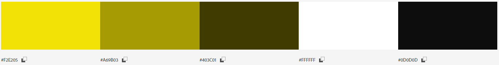
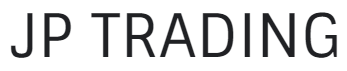
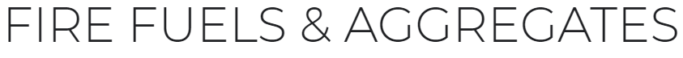

# JP TRADING LTD

Code Institute, Diploma in Full Stack Software Development,
Milestone Project 2, March 2020.

# Table of Contents 
1. [Overview](#overview)
    * [Design Simulation](#design-simulation)
2. [User Experience Design](#user-experience-design)
   * [User Stories](#user-stories)
   * [Business Objective](#business-objective)
    *  [Design](#design)
        * [Structure](#structure)
        * [Wireframes](#Wireframes)
        * [Color Scheme](#color-scheme)
        * [Typography](#typography)
        * [Imagery](#imagery)
        * [Design Limitations](#design-limitations)
        * [Design Differences](#design-differences)
3. [Features](#features)
4. [Technologies](#technologies)
5. [Testing](#testing)
    * [Funtionality and Features](#Funtionality-and-Features)
    * [User Stories Test](#User-Stories-Test)
    * [Strategic Purpose Test](#Strategic-Purpose-Test)
    * [Bugs and Fixes](#Bugs-and-Fixes)
    * [Testing Limitations](#Testing-Limitations)
6. [Deployment](#deployment)
    * [Deployment via GitHub Pages](#Deployment-via-GitHub-Pages)
    * [Making a Clone in GitPod](#Making-a-Clone-in-GitPod)
7. [Credits](#credits)
    * [Images](#Images)
    * [Content](#Content)
    * [Color Psychology](#Color-Psychology)
    * [Code](#Code)
    * [Acknowledgements](#Acknowledgements)

## Overview
JP Trading is family owned business selling fire fuels, aggregates and garden furniture in the East Cork area
of Ireland over the last 8 years.
Currently they have no online presence and would like to establish themselves online to increase growth/retention
of customers and keep up to date with industry standards. 

This website is created to be a landing space for consumers searching for the above mentioned products in the 
Midleton and East Cork area.
The site will be a marketing tool to promote products on sale, offer contact information/location and
provide a means of contacting the business.

It should be an asset to the business to increase growth,
while also being of value to the consumer and improving their consumer experience.

### Design Simulation
A simulation of the website on desktop and mobile devices can be seen below.

## User Experience Design

### User Stories

| **As a First Time and Returning I would like to** : |  **So that I can**  : |
| ------------- |:-------------:|
| easily understand the main purpose of the site | determine if it is what I need |
| use an aesthetically pleasing site| enjoy my user experience |
| easily navigate the site| quickly find what I need |
| find information is clearly presented | absorb it with minimal effort |
| have features load quickly | save time |
| view the site on different screen sizes| use it at home or on the go |
| learn about the company background/offering| assess whether it is suitable for my needs/something I would like to support | 
| search a list of available products| can save time scrolling and easily find what I need|
| calculate a quick quote | quickly assess if the product is good value & cut down on talk time with a sales person | 
| find the trading hours| assess whether they suit my availability |
| find contact information | call or save it for use later |
| contact the business on their platform | save time copying email addresses or opening another platform |
| find their location | plan a trip to visit the store or asses if they are suitable suppliers |

### Business Objective

| **As the business owner I would like the site to** : |  **So that**  : |
| ------------- |:-------------:|
| Increase our visibility | we can promote sales growth|
| Show case our products & services | we can increase sales and consumer awareness|
| Be adapted to screen readers| we do not discriminate and optimise catchment|
| Be easy and enjoyable to use| it will create a good impression of the business, increase usage time and return visits|
| Provide a quoting service| we can cut down on calls & administration|
| Provide a  structured means of contact| to reduce calls|

### Design
#### Structure

**Skeleton**

The site will be made up of three pages with one main section
per page, all pages will have a 'sticky' navigation bar at the top and a small copyright footer.

**Information Architecture**

The home page will consist of a large hero image with a text introduction of the 
business. This will describe the business and the services available. Icons traditionally
associated with the services offered will be displayed lower down and will reinforce
this information allowing the information to be easily assimilated by the user. 

The second page will be a gallery of current products in stock with some pricing information.
There will be a feature to quick search through the products. A call to action alert will be created
if an item is found in the search. This call to action will link the user to the contact the business. 

The third page will provide contact information, the premise location and a contact form.

**Interaction Design**

The navigation bar will highlight on hover and active status.

The text introduction on the home page will be animated, similar to a carosel, with short paragraphs 
of information. Icons on the homepage will display discriptive text when clicked.

The user will be able to interact with the data on the second page by searching through the products available
and calculate a quote for some items.

On the third page the user will be able to send an email to the business and view the location of its premise.
A confirmation message will display when the email has been sent successfully or an error if unsuccessfull.

#### Wireframes
A mock up of how the site will be layed out is available here via [Wire Frames](assets/read_me/wire_frames.pdf).

*Please note: To open any links in this document in a new browser tab, please press `CTRL + Click`.*

#### Color Scheme

The above color swatch shows a guide line for the color scheme of the site, 
Colors are brand colours which have been adopted for the following reasons:

Color | Consumer Association
------|---------------------
Black | stability, confidence
Yellow| logical, cheerful
Browns| resilience, dependability, security, and safety.

This colour combination is a classic pairing used in by many well known fire fuel brands and therefore
instils a sense of brand establishment and reliabilty in the subconscious of the consumer by association with
well known brands. 

#### Typography

The Sintony font, created by *Eduardo Rodriguez Tunn* for [Google Fonts](https://fonts.google.com/) will be the main font for the company name 
and for headings, alternating between regular and bold. Its slightly square and smooth structure lends well to bolder headings, 
demanding the readers attention.

Montserrat which is designed by *Julieta Ulanovsky, Sol Matas, Juan Pablo del Peral, Jacques Le Bailly* and also 
available on Google Fonts, will be the secondary font used for the main body of text and sub headings. 

Sans Serif will be the fallback font if for any reason the main fonts are not being imported 
or displayed correctly. Sintony is a variation of Sans Serif, if the chosen font should
not display the back up font should blend seamlessly. 

Both fonts are easily readable with strong straight lines which should be easily read by the user.

#### Imagery
Branding is an important design and marketing tool for establishing your business in the mind of the user.
A logo was created using [canva.com](https://www.canva.com/). Consistant imagery inline with the businesses
offering was used through out the site to reinforce that brand identity and convey the business offering 
intuitively. Images were sourced from open source sites or were provided by JP.Trading. For a detailed list of 
photographers and sources please see the [credits](#credits) section.

#### Design Limitations

!!!!(TBA)!!!

#### Design Differences from Conception

!!!!(TBA)!!!

## Features

 1. Responsive to different screen sizes.
 2. Supported by Chrome, Microsoft Edge and Firefox browsers.
 3. Adapted for users with special accessibility requirements where possible.
 4. There will be three pages: Home page, Browse products page and a contact page.

        - Each page will have a navigation header.
        - Each page will have a footer.
        - Each page will have a favicon on the browser tab.

 5. Each page will have a 'sticky' nav bar.

        - Navbar will be black with white text.
        - The nav bar will have a company name logo on the left and menu options to the right.
        - The logo will always link to the home page when clicked.
        - The active page will be emphasized with a heavier font weight in the nav menu, inactive pages will have a lighter font weight.
        - Menu items will underline from center when hovered over.
        - On mobile devices the menu items will switch to a toggle button and a dropdown.
        - The menu items will have the same styling in the drop down.
        
 6. The home page will have:

        - A hero image.
        - Animated informative text.
        - Interactive icons.
        - A call to action.

7. The Browse Products page will have:

        - A search bar.
        - Cards displaying product images and text.
        - A quick quote calculator.
        - A background image.

8. The Contact Page will have:

        - A google map API.
        - An email API.
        - Informative text.
        - A confirmation or error alert for the contact form.

9. The Contact Form wil have:

        - The form will be grey with white fields and white button.
        - A name, email and text area input.
        - All inputs will be mandatory and display an error message if a field is missing on submission.
        - The border wil be black and of a 1-2px weight when hovered over.
        - The submission button will have a Send it! value.
        - The button will be yellow with black text on hover.

10. The Search Bar will be:

        - Yellow with black text and a white text input space.
        - Have a drop down to select from as a user types.

11. The Quote Calculator will have:

        - TBA!!!!!!!!

12. The footer will have:

        - The footer will be black with white text.
        - The footer text will display copywrite information.

 ## Technologies

 ### Languages

 - [HTML5](https://www.w3schools.com/html/html_intro.asp)
 - [CSS3](https://www.w3schools.com/css/css_intro.asp)
 - [JavaScript](https://www.w3schools.com/js/js_intro.asp)

 ### Frameworks & Libraries

  1. [Balsamiq](https://balsamiq.com/) Used to create wireframes/mock-up during the planning & design process. 
  2. [Git Hub](https://github.com/about) Used to store, version control and share the projects code.
  2. [Git/GitPod](https://www.gitpod.io/#:~:text=Gitpod%20is%20a%20multi%2Dservice,their%20own%20dedicated%20K8s%20deployment.) Code, build, debug and run K8s applications entirely in the cloud.
  3. [Bootstrap](https://getbootstrap.com/) Used for responsivness and styling of the site.
  4. [JQuery](https://jquery.com/)Javascript library
  5. [Google Fonts](https://fonts.google.com/) Used to import fonts.
  6. [Font Awesome](https://fontawesome.com/v4.7.0/) Used for icons.

### Programmes & Tools

  1. [Canva](https://www.canva.com/) For creation of the logo.
  2. [Adobe Color Wheel](https://color.adobe.com/create/image-gradient) Image gradient feature was used to extract colors used in the logo and build a colour scheme.
  3. [Am I Responsive](http://ami.responsivedesign.is/) Used to check responsivity of code and display the mock up in the documentation.
  4. [MicroSoft Sniping Tool](https://support.microsoft.com/en-us/windows/use-snipping-tool-to-capture-screenshots-00246869-1843-655f-f220-97299b865f6b) Used for various images, such as the color swatch and
        extraction of usedful information for my project drafts and plans.
  5. [TinyJPG](https://tinyjpg.com/)For resizing images to decrease loading time.
  6. [Chrome Developer Tools](https://developers.google.com/web/tools/chrome-devtools) Used to test and optimize the site.

## Testing

### Code Validity

1. [W3C](https://validator.w3.org/) used to validate HTML code.
2. [W3c Jigsaw](https://jigsaw.w3.org/css-validator/) used to validate CSS code.
3. [JS Hint](https://jshint.com/) used to validate JavaScript code.

