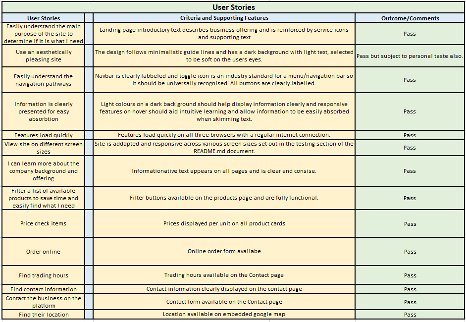
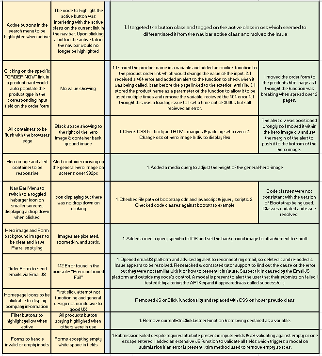

# JP TRADING LTD

Code Institute, Diploma in Full Stack Software Development,
Milestone Project 2, March 2020.

# Table of Contents 
1. [Overview](#overview)
    * [Design Simulation](#design-simulation)
2. [User Experience Design](#user-experience-design)
   * [User Stories](#user-stories)
   * [Business Objective](#business-objective)
    *  [Design](#design)
        * [Structure](#structure)
        * [Wireframes](#Wireframes)
        * [Color Scheme](#color-scheme)
        * [Typography](#typography)
        * [Imagery](#imagery)
        * [Design Limitations](#design-limitations)
        * [Design Differences from Conception](#design-differences-from-conception)
3. [Features](#features)
4. [Technologies](#technologies)
5. [Testing](#testing)
    * [Code Validity](#code-validity)
    * [Testing Premise](#testing-premise)
6. [Deployment](#deployment)
    * [Deployment via GitHub Pages](#Deployment-via-GitHub-Pages)
    * [Making a Clone in GitPod](#Making-a-Clone-in-GitPod)
7. [Credits](#credits)
    * [Images](#Images)
    * [Code](#Code)
    * [Color Psychology](#Color-Psychology)
    * [Acknowledgements](#Acknowledgements)

## Overview
JP Trading is a family-owned business selling fire fuels, aggregates, and garden furniture in the East Cork area
of Ireland over the last 8 years.
Currently, they have no online presence and would like to establish themselves online to increase growth/retention
of customers and keep up to date with industry standards. 

This website is created to be a landing space for consumers searching for the above-mentioned products in the 
Midleton and East Cork area.
The site will be a marketing tool to promote products on sale, offer contact information/location and
provide a means of contacting the business.

It should be an asset to the business to increase growth,
while also being of value to the consumer and improving their consumer experience.

### Design Simulation

A simulation of the website on desktop and mobile devices can be seen below.

This live site can be accessed [*here*](https://janeyrinn.github.io/jp_trading/).

*Please note: To open any links in this document in a new browser tab, please press `CTRL + Click`.*

## User Experience Design

### User Stories

| **As a First Time and Returning I would like to** : |  **So that I can**  : |
| ------------- |:-------------:|
| easily understand the main purpose of the site | determine if it is what I need |
| use an aesthetically pleasing site| enjoy my user experience |
| easily navigate the site| quickly find what I need |
| find information is clearly presented | absorb it with minimal effort |
| have features load quickly | save time |
| view the site on different screen sizes| use it at home or on the go |
| learn about the company background/offering| assess whether it is suitable for my needs/something I would like to support | 
| filter a list of available products| can save time scrolling and easily find what I need|
| price check items | quickly assess if the product is good value & cut down on talk time with a salesperson |
| order online | make purchases out of hours |
| find the trading hours| assess whether they suit my availability |
| find contact information | call or save it for use later |
| contact the business on their platform | save time copying email addresses or opening another platform |
| find their location | plan a trip to visit the store or asses if they are suitable suppliers |

### Business Objective

| **As the business owner I would like the site to** : |  **So that**  : |
| ------------- |:-------------:|
| Increase our visibility | we can promote sales growth|
| Showcase our products & services | we can increase sales and consumer awareness|
| Be adapted to screen readers| we do not discriminate and optimize catchment|
| Be easy and enjoyable to use| it will create a good impression of the business, increase usage time and return visits|
| Provide an online order service | to increase trading hours |
| Provide a  structured means of contact| to reduce calls|

## Design

### Structure

**Skeleton**

The site will be made up of three pages with one to two main sections
per page, all pages will have a 'sticky' navigation bar at the top and a small copyright footer.

**Information Architecture**

The home page will consist of a large hero image with an animated text introduction of the 
business and a brief company description. This will describe the business and the services available. Icons traditionally
associated with the services offered will be displayed lower down and will reinforce
this information allowing the information to be easily assimilated by the user.

The second page will be a gallery of current products in stock with some pricing information.
There will be a feature to filter through the products. A call-to-action link will be
on each product card. This call-to-action will link the user to an order form lower down the page.

The third page will provide contact information, the premise location, and a contact form.

**Interaction Design**

The navigation bar will highlight and underline on hover and highlight only on active status.

The text introduction on the home page will be animated on loading, with the company name and a short sentence
of information. Icons on the homepage will change colour on hover and
will display descriptive text when double-clicked.

The user will be able to interact with the data on the second page by searching through the products available
using filtering buttons and place an order through an emailJS order form.

The order form will pre-populate the product type field from the clicked link in the product card. The form 
will also validate the quantity for the business and alert the customer if the quantity is too large for online orders.

On the third page, the user will be able to send an email to the business via emailJS and view the location of its premise on Google Maps.
A confirmation message will display when the email has been sent successfully or an error if unsuccessful.

### Wireframes
A mock-up of how the site will be laid out is available here via [Wire Frames](wireframes/wireframes.pdf).

*Please press `CTRL + Click` to open in a new window.*

### Color Scheme

The above color swatch shows a guideline for the color scheme of the site, 
Colors are brand colours that have been adopted for the following reasons:

Color | Consumer Association
------|---------------------
Black | stability, confidence
Yellow| logical, cheerful
Browns| resilience, dependability, security, and safety.

This colour combination is a classic pairing used by many well-known fire fuel brands and therefore
instills a sense of brand establishment and reliability in the subconscious of the consumer by association with
well-known brands. 

### Typography

The Sintony font, created by *Eduardo Rodriguez Tunn* for [Google Fonts](https://fonts.google.com/) will be the main font for the company name 
and headings, alternating between regular and bold. Its slightly square and smooth structure lends well to bolder headings, 
demanding the reader's attention.

Montserrat which is designed by *Julieta Ulanovsky, Sol Matas, Juan Pablo del Peral, Jacques Le Bailly* and also 
available on Google Fonts, will be the secondary font used for the main body of text and subheadings. 

Sans Serif will be the fallback font if for any reason the main fonts are not being imported 
or displayed correctly. Sintony is a variation of Sans Serif, if the chosen font should
not display the back-up font should blend seamlessly. 

Both fonts are easily readable with strong straight lines which should be easily read by the user.

### Imagery

Branding is an important design and marketing tool for establishing your business in the mind of the user.
A logo was created using [canva.com](https://www.canva.com/). Consistent imagery in line with the businesses
offering was used throughout the site to reinforce that brand identity and convey the business offering 
intuitively. Images were sourced from open source sites or were provided by JP.Trading. For a detailed list of 
photographers and sources please see the [credits](#credits) section.

### Design Limitations

In the future, we would like to add an option for the customer to create a customer account to keep track of their orders and for the business's 
marketing purposes. A payment feature would also be added to the order form.

### Design Differences from Conception

Originally there had not been a plan for an order form, at the time of the creation of the Wire Frames, but I felt the addition added significant value for the 
consumer and the business. The form has since been added to the products page. 
Hero images have also been added to the products and contact page after design conception, they improve the aesthetics of each page.
A brief company introduction was also added to the landing page to increase band identity and clarify the company offering to the consumer

## Features

 1. Responsive to different screen sizes.
 2. Supported by Chrome, Microsoft Edge, and Firefox browsers.
 3. Adapted for users with special accessibility requirements where possible.
 4. There will be three pages: Home page, Products page, and a Contact page.

        - Each page will have a navigation header.
        - Each page will have a footer.
        - Each page will have a favicon on the browser tab.

 5. Each page will have a 'sticky' navbar.

        - Navbar will be black with white text.
        - The nav bar will have a company name logo on the left and menu options to the right.
        - The logo will always link to the home page when clicked.
        - The active page will be emphasized with a heavier font-weight in the nav menu, inactive pages will have a lighter font weight.
        - Menu items will underline from the center when hovered over.
        - On mobile devices, the menu items will switch to a toggle button and a dropdown.
        - The menu items will have the same styling in the drop-down.
        
 6. The home page will have:

        - A hero image.
        - Animated informative text.
        - Interactive icons.

7. The Products page will have:

        - A hero image & text banner.
        - A filter functionality for products.
        - On load: cards displaying all product images, text, and a link to order.
        - An order form.
        - A confirmation or error alert on submission for the form.

8. The Contact Page will have:

        - A hero image & text banner.
        - A google map displaying the premise location.
        - A messaging service.
        - A confirmation or error alert on submission for the contact form.
        - Informative text.

9. The Contact Form will have:

        - The form will be black with white fields and a transparent button.
        - A name, email, and text area input.
        - All inputs will be mandatory and display an error message if a field is missing or incorrect on submission.
        - The border will be yellow and of a 1-2px weight when hovered over.
        - The submission button will have a Send it! value.
        - The button will be yellow on hover.
        - A modal message to signal successful or unsuccessful submission.

10. The Search Bar will be:

        - White text and yellow on hover with a filter button.
        - When the text or filter buttons are clicked 4 toggled buttons displaying product categories will appear below.
        - These buttons when selected will filter the display by category.
        - An active button will be yellow, inactive will be white and yellow on hover, all with black text.

11. The Order Form:

        - The form will be black with white fields and a transparent button.
        - Fields will include a name, email, mobile number, product type, quantity, and text area input.
        - All inputs will be mandatory and display an error message if a field is missing or incorrect on submission.
        - The border will be yellow and of a 1-2px weight when hovered over.
        - The submission button will have a Send it! value.
        - The button will be yellow on hover.
        - A modal message to signal successful or unsuccessful submission.

12. The footer will have:

        - The footer will be black with white text.
        - The footer text will display Copywrite information.

 ## Technologies

 ### Languages

 - [HTML5](https://www.w3schools.com/html/html_intro.asp)
 - [CSS3](https://www.w3schools.com/css/css_intro.asp)
 - [JavaScript](https://www.w3schools.com/js/js_intro.asp)

 ### Frameworks & Libraries

  1. [Balsamiq](https://balsamiq.com/) Used to create wireframes/mock-up during the planning & design process. 
  2. [Git Hub](https://github.com/about) Used to store, version control, and to share the project's code.
  2. [Git/GitPod](https://www.gitpod.io/#:~:text=Gitpod%20is%20a%20multi%2Dservice,their%20own%20dedicated%20K8s%20deployment.) Code, build, debug and run K8s applications entirely in the cloud.
  3. [Bootstrap](https://getbootstrap.com/) Used for responsiveness and styling of the site.
  4. [JQuery](https://jquery.com/) Javascript library
  5. [Google Fonts](https://fonts.google.com/) Used to import fonts.
  6. [Font Awesome](https://fontawesome.com/v4.7.0/) Used for icons.
  7. [AOS Library](https://michalsnik.github.io/aos/) & [AOS Guide](https://www.sitepoint.com/cool-scroll-animations-made-easy-aos-library/) Used for animation on landing page intro text. 

### Programmes & Tools

  1. [Canva](https://www.canva.com/) For the creation of the logo.
  2. [Adobe Color Wheel](https://color.adobe.com/create/image-gradient) Image gradient feature was used to extract colors used in the logo and build a colour scheme.
  3. [Am I Responsive](http://ami.responsivedesign.is/) Used to check responsivity of code and display the mock-up in the documentation.
  4. [MicroSoft Snipping Tool](https://support.microsoft.com/en-us/windows/use-snipping-tool-to-capture-screenshots-00246869-1843-655f-f220-97299b865f6b) Used for various images, such as the color swatch and
        extraction of useful information for my project drafts and plans.
  5. [TinyJPG](https://tinyjpg.com/)For resizing images to decrease loading time.
  6. [Chrome Developer Tools](https://developers.google.com/web/tools/chrome-devtools) Used to test and optimize the site.
  7. [Windows Paint](https://support.microsoft.com/en-us/windows/get-microsoft-paint-a6b9578c-ed1c-5b09-0699-4ed8115f9aa9) for the deployment diagrams in the README.md

### Sources

_General sources of information for structure functionality and styling._

1. [MDN Web Docs](https://developer.mozilla.org/)
2. [Youtube](https://www.youtube.com/)
3. [W3 Schools](https://www.w3schools.com/js/default.asp)
4. Code Institute, Full Stack Development course material.

## Testing

### Code Validity

The syntax and validity of the HTML and JavaScript code used were passed through the two validators mentioned below and passed all tests without error or warnings.

1. [W3C](https://validator.w3.org/) used to validate HTML code.
2. [JS Hint](https://jshint.com/) used to validate JavaScript code.

The syntax and validity of the CSS code was passed throught the below validator and passed without error but did show warnings related to vendor prefixes.I have been advised by tutor support that this is fine for the submission of the MS2 and should not affect the outcome of the submission as it is unavoidable with the current version of this validator.

1.[W3c Jigsaw](https://jigsaw.w3.org/css-validator/) used to validate CSS code.

### Testing Premise

The entire site was tested under the three premises of :

        > User Stories
        > Business Objective
        > Features

Testing was done on three browsers; Chome v88, MicroSoft Edge v88 and FireFox v83 on the below screen sizes:

> **Chrome & Microsoft Edge**
> - Moto G4 (640 x 360)
> - Galaxy S5 (360 x 640)
> - Pixel 2 (411 x 731)
> - Pixel 2 XL (411 x 823)
> - iPhone 5/SE (320 x 568)
> - iPhone 6/7/8 (375 x 667)
> - iPhone 6/7/8 Plus (414 x 736)
> - iPhone X (375 x 812)
> - iPad (768 x 1024)
> - iPad Pro (1024 x 1366)
> - Surface Duo (540 x 720)
> - Galaxy Fold (280 x 653)
> - Laptop (1440 x 900)

> **Mozilla Fire Fox**
> - Galaxy Note 3 (360 x 640)
> - Galaxy Note 9 (414 x 846)
> - Galaxy S5 (360 x 640)
> - Galaxy S9 (360 x 740)
> - iPad (768 x 1024)
> - iPad Pro (1024 x 1366)
> - iPhone 5/SE (320 x 568)
> - iPhone 6/7/8 (375 x 667)
> - iPhone 6/7/8 Plus (414 x 736)
> - iPhone X/XS (375 x 812)
> - i Phone XR (414 x 896)
> - Laptop (1440 x 900)

The site was tested for Safari using an iPhone 11 but I could not test other screen sizes on this device.

Testing was documented using Microsoft Excel and the full spreadsheet can be found [*here*](testing/testing.xlsx).

The live site  was also analysed using Google Developer Tools Lighthouse feature, where it scored highly for accessibility, best practices and SEO.
The performance of the site scored in the median range despite all images being compressed and sized to the best of the developers ability. Further adjustments to improve this rating
are outside the scope of the assignment and the developers skill set at this time but will be researched and improved going forward.

Bugs found in the code and their fixes can also be found in the Excel document.

#### Users Stories

#### Business Objectives

#### Features

#### Bugs and Fixes

## Deployment

#### Deployment via GitHub Pages

1. Select the _Repository_ you wish to deploy.
2. Under the _"Repo"_ name on the top left of the screen
there is a menu, select the settings tab on this menu 

3. Scroll down to the **GitHub Pages** section.
4. Under **Source** use the **None or Branch** drop-down menu to select the 
publishing source you wish to use **Main** is recommended. 

5. Select **Save** and refresh the page. 
6. Your published address will appear in a green highlighted container above **Source**.
7. Click the link to test it works.

#### Making a Clone in GitPod
1. Select the _Repo_ you wish to clone in GitHub.
2. Click on the Code dropdown button.

3. Copy the link to your clipboard.
4. Open Git Bash.
5. In the console type _"git clone"_ and paste the copied link.
6. Hit enter to create the clone.

    - To view what the code will look like in a browser from here type _" python3 -m http.server"_
        into the console and hit enter.
    - A pop-up will appear stating "A service is available on Port 8000" select **Open Browser**.

## Credits

### Images 

Credits to the following photographers and open-source platforms for use and supply of their images.

1. Hero images on the landing page were taken by user [ilaria88](https://www.pexels.com/@ilaria88-32645?utm_content=attributionCopyText&utm_medium=referral&utm_source=pexels) 
at pexels.com .
2. Coal by [JeffersonSees](https://unsplash.com/@jeffersonsees) at unsplash.com.
3. Firewood by [Waldemar Brandt](https://unsplash.com/@waldemarbrandt67w) at unsplash.com.
4. Peat by [Martaposemuckel](https://pixabay.com/users/martaposemuckel-17386/?utm_source=link-attribution&utm_medium=referral&utm_campaign=image&utm_content=260014) at pixabay.com.
5. Kindling [Masaaki Komori](https://unsplash.com/@gaspanik) at unsplash.com.
6. Ventry Sandstone [Karolina Grabowska](https://www.pexels.com/@karolina-grabowska?utm_content=attributionCopyText&utm_medium=referral&utm_source=pexels) at pexels.coms.
7. Wicklow Plum [Arya Kratos](https://www.pexels.com/@arya-kratos-14739?utm_content=attributionCopyText&utm_medium=referral&utm_source=pexels) at pexels.com
8. All other images are the property of JP Trading.

### Code

1. [Mark Down](https://github.com/adam-p/markdown-here/wiki/Markdown-Cheatsheet) 
2. [Hero Image CSS on Landing/Home Page](https://www.youtube.com/watch?v=FSF2VA1rsI4&t=327s) some properties learned and adapted for the project.
3. [Search Products Menu](https://www.w3schools.com/howto/howto_js_portfolio_filter.asp) code learned and adapted to suit this feature.
4. [Form Validtation](https://www.w3schools.com/js/js_validation.asp) code learned and adapted to validate product quantity.
5. [Text Animation](https://www.sitepoint.com/cool-scroll-animations-made-easy-aos-library/) learned how to use the AOS Library.
6. [IOS Specific Media Query](https://stackoverflow.com/questions/30102792/css-media-query-to-target-only-ios-devices).

### Color Psychology

1. [Black](https://www.empower-yourself-with-color-psychology.com/color-black.html).
2. [Yellow]( https://www.empower-yourself-with-color-psychology.com/yellow-in-business.html).

### Acknowledgements

Special thanks to:
1. The tutors at Code Institute for their guidance and support.
2. My mentor Rohit Sharma for his guidance and advice throughout.
3. My peers on the slack community for assistance with testing and guidance throughout the project.